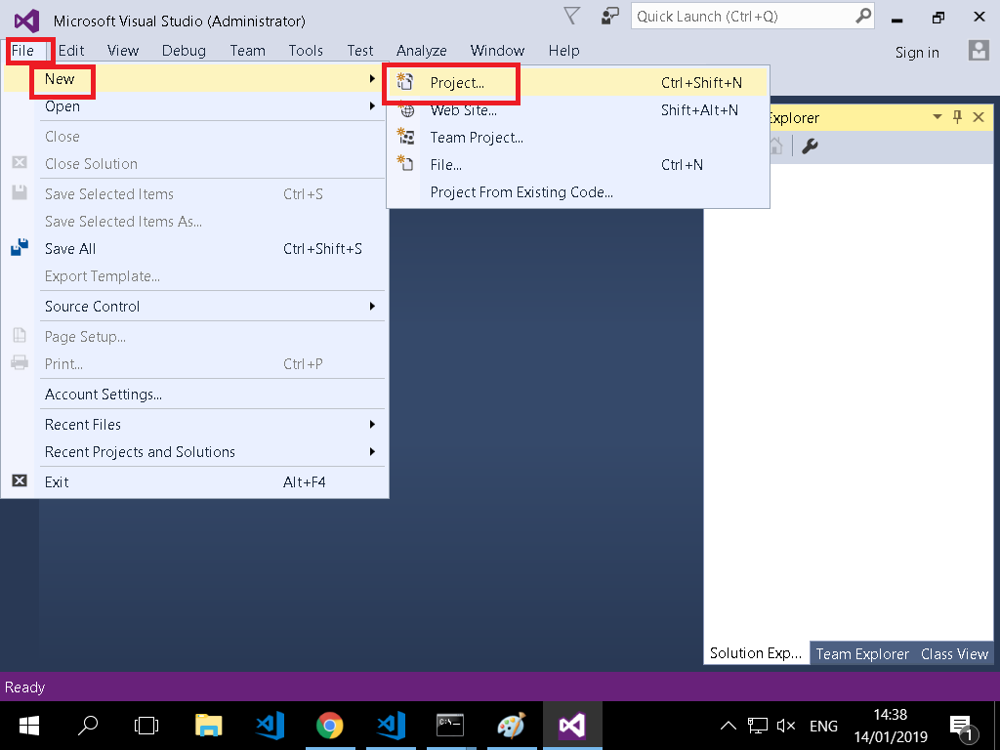
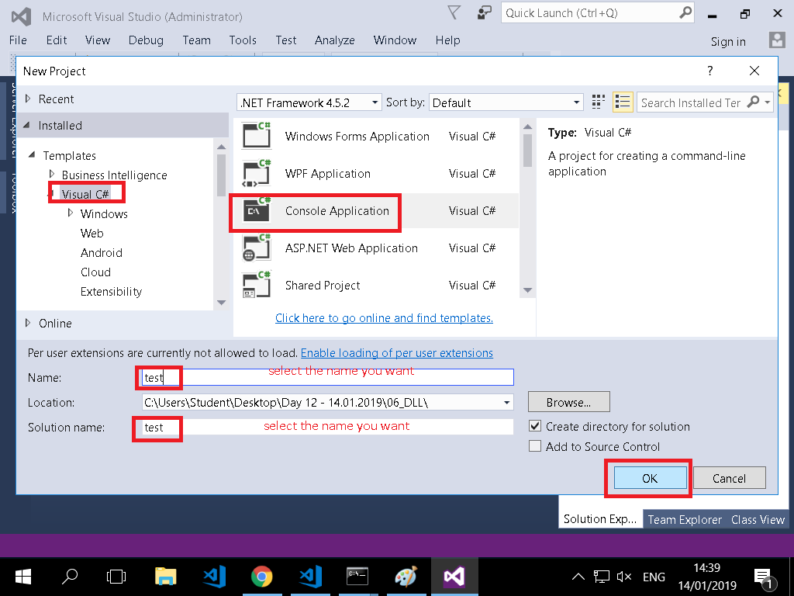
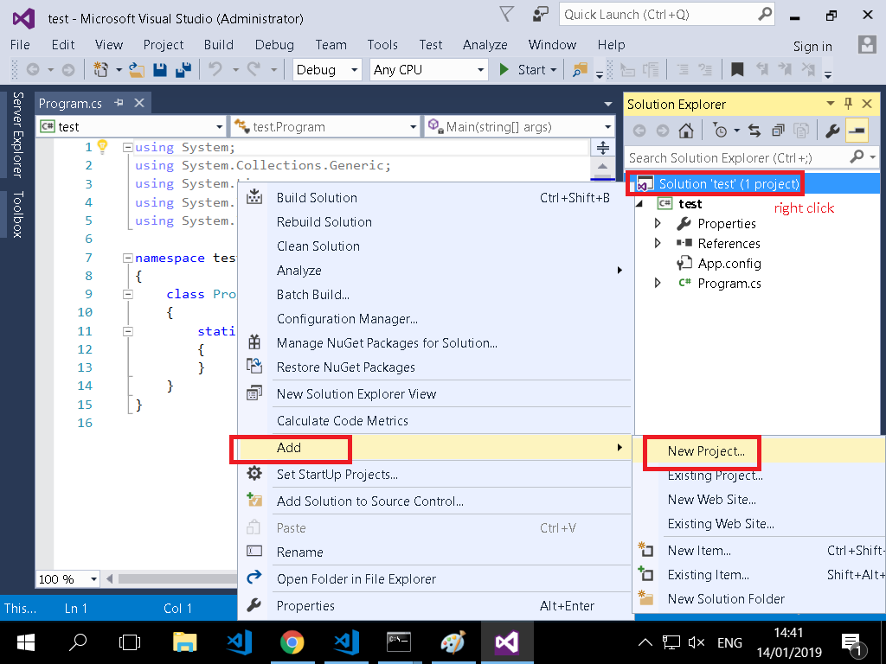
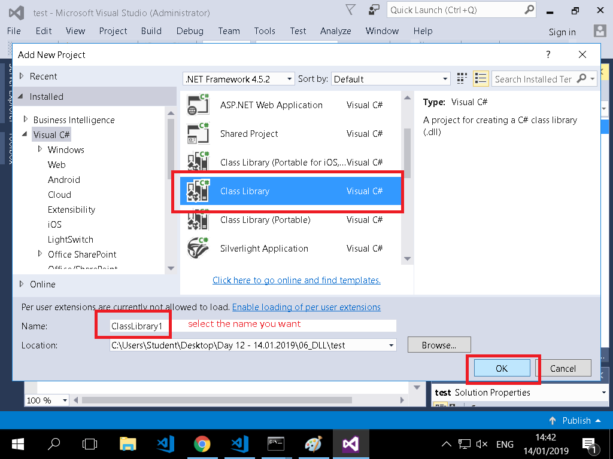
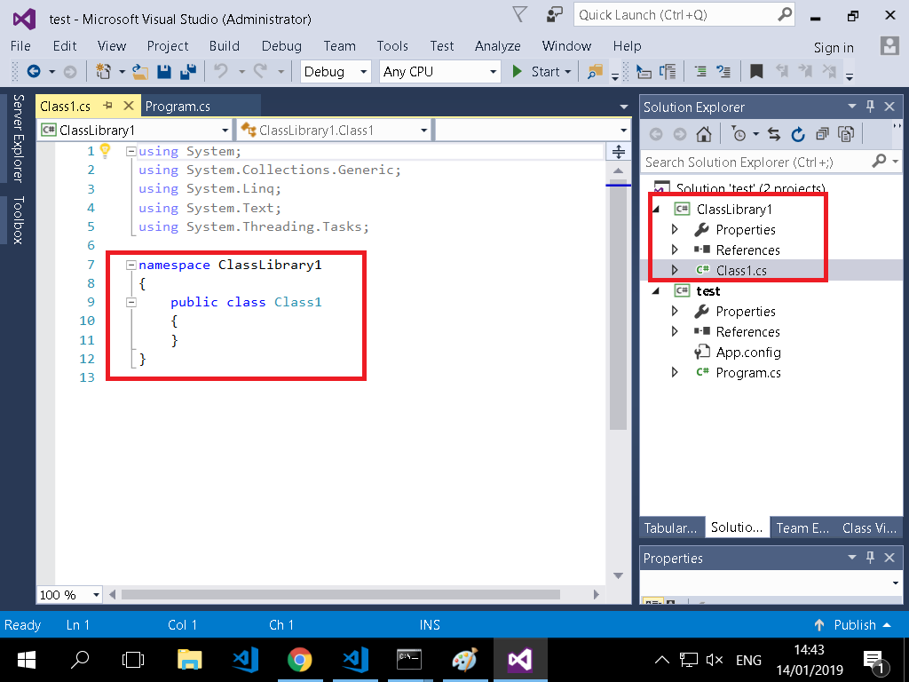
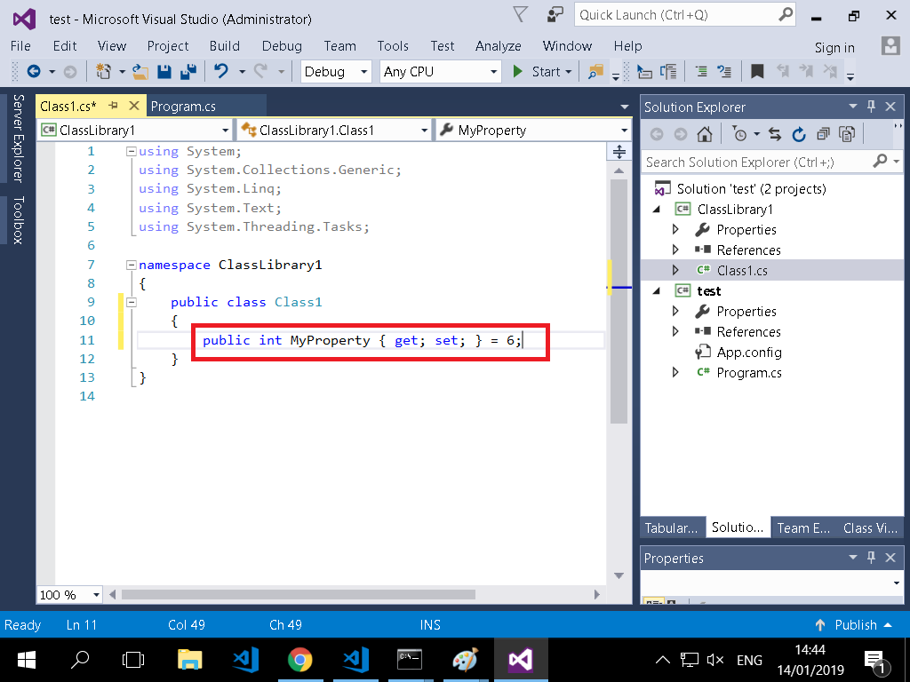
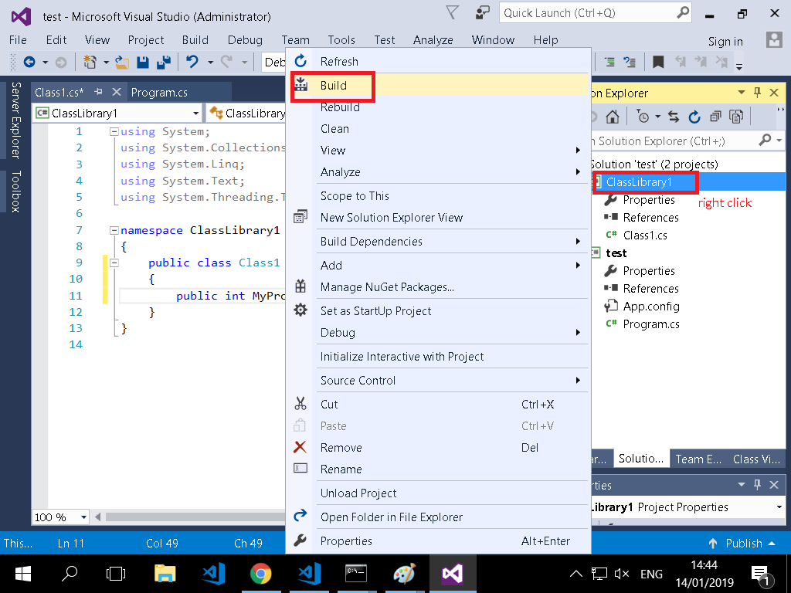
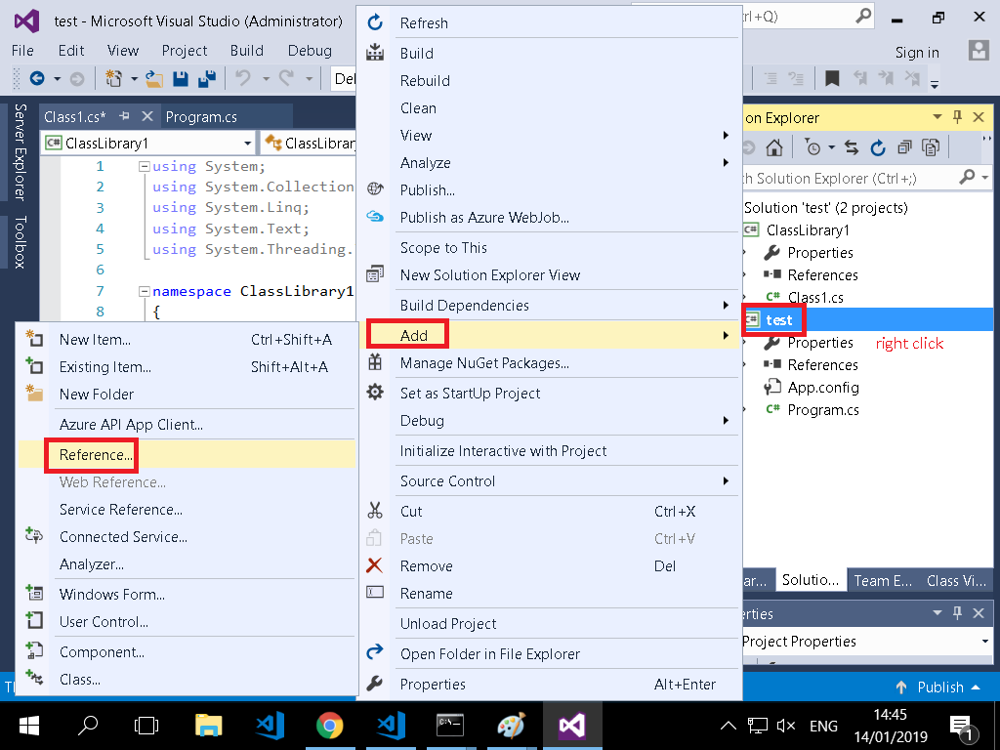
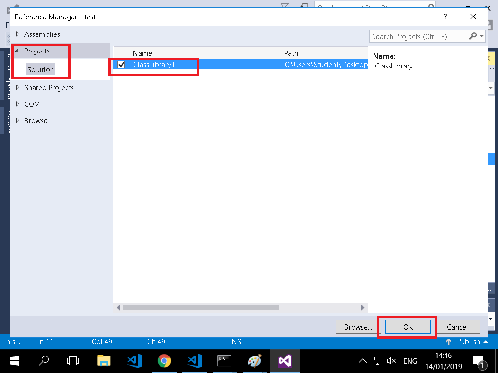
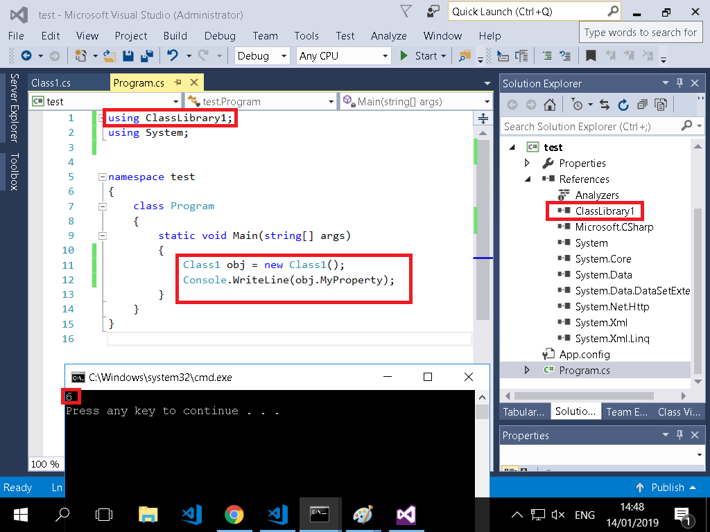

# Steps to craete a `console app` with `dll`
open visual studio

 
 
 

 
 
 

***

 
 
 

 
 
 

***

 
 
 

 
 
 

***

 
 
 

 
 
 

***

 
 
 

 
 
 

***

 
 
 

 
 
 

***

 
 
 

 
 
 

***

 
 
 

 
 
 

***

 
 
 

 
 
 

***

 
 
 

 
 
 

***

 
 
 